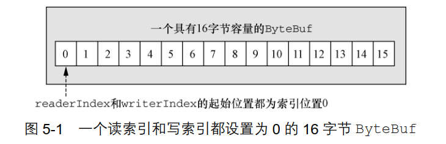

## 第五章 ByteBuf

1. Netty的数据处理API通过两个组件暴露——abstract class ByteBuf 和 interface ByteBufHolder。

2. ByteBuf 维护了两个不同的索引：一个用于读取，一个用于写入。  当你从 ByteBuf 读取时，
   它的 readerIndex 将会被递增已经被读取的字节数。同样地，当你写入 ByteBuf 时，它的
   writerIndex 也会被递增。  结构如图：

   

3. 名称以 read 或者 write 开头的 ByteBuf 方法，将会推进其对应的索引，而名称以 set 或
   者 get 开头的操作则不会。  

4. 可以指定 ByteBuf 的最大容量。 试图移动写索引（ 即 writerIndex） 超过这个值将会触
   发一个异常①。（默认的限制是 Integer.MAX_VALUE。）  

5. ByteBuf的使用模式：

   1. 堆缓冲区：将数据存储在JVM的堆空间中。被称为支撑数组，它能在没有使用池化的情况下提供快速的分配和释放。适合于有遗留数据需要处理的情况。
   2. 直接缓冲区：JVM通过本地调用分配内存给ByteBuf（JVM管理范围外）。
   3. 复合缓冲区：为多个ByteBuf提供了一个聚合视图，可以根据需要添加或者删除ByteBuf实例。（通过子类CompositeByteBuf实现）

6. 调用discardReadBytes()方法，可移除可丢弃字节（读过，readerIndex左边），可能导致内存制。

7. ByteBuf的可读字节分段存储了实际数据。新分配的、包装的或者复制的缓冲区的默认的readerIndex 值为 0。任何名称以 read 或者 skip 开头的操作都将检索或者跳过位于当前readerIndex 的数据，并且将它增加已读字节数。  

8. 可写字节分段是指一个拥有未定义内容的、写入就绪的内存区域。新分配的缓冲区的writerIndex 的默认值为 0。任何名称以 write 开头的操作都将从当前的 writerIndex 处开始写数据，并将它增加已经写入的字节数。如果写操作的目标也是 ByteBuf，并且没有指定
   源索引的值，则源缓冲区的 readerIndex 也同样会被增加相同的大小。  

9. 可以通过调用 markReaderIndex()、 markWriterIndex()、 resetWriterIndex()和 resetReaderIndex()来标记和重置ByteBuf 的 readerIndex 和 writerIndex。  可以通过调用 clear()方法来将 readerIndex 和 writerIndex 都设置为0。注意， 这并不会清除内存中的内容。  

10. ByteBuf的派生将和源ByteBuf共享数据，但有自己的独立标记。使用copy将会从源ByteBuf保存一份副本。

11. Netty通过ByteBufHolder提供了存储实际的数据负载之外， 存储各种属性值 。

12. 为了降低分配和释放内存的开销， Netty 通过 interface ByteBufAllocator 实现了（ ByteBuf 的）池化， 它可以用来分配我们所描述过的任意类型的 ByteBuf 实例。  可以通过 Channel（每个都可以有一个不同的 ByteBufAllocator 实例）或者绑定到ChannelHandler 的 ChannelHandlerContext 获取一个到 ByteBufAllocator 的引用。  

13. Netty提供了两种ByteBufAllocator的实现： PooledByteBufAllocator和UnpooledByteBufAllocator。前者池化了ByteBuf的实例以提高性能并最大限度地减少内存碎片。此实现使用了一种称为jemalloc池化ByteBuf实例， 并且在每次它被调用时都会返回一个新的实例。  