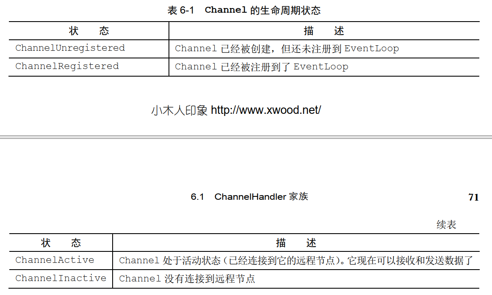
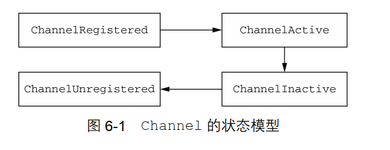

## 第六章 ChannelHandler和ChannelPipeline

1. Channel生命周期：

   

   

2. ChannelHandler的生命周期：

   

3. ChannelHandler子接口：

   1. ChannelInboundHandler：处理入站数据及各种状态变化
   2. ChannelOutboundHandler：处理出战数据并允许拦截所有操作。

4. ChannelOutboundHandler可以按需推迟操作或者事件。

5. ChannelPromise是ChannelFuture的子类。

6. ChannelHandlerAdapter提供了isSharable()方法。如果对应的实现被标注为Sharable则返回true，表示是可共享的（ChannelPipeline之间）。

7. 在写消息时，如果要释放消息，不仅要通过使用ReferenceCountUtil.lease()方法释放消息的引用，还要通知channelPromise。如果消息到达了实际的传输层， 那么当它被写入时或者 Channel 关闭时，都将被自动释放。  

8. 每一个新创建的 Channel 都将会被分配一个新的 ChannelPipeline。这项关联是永久性的； Channel 既不能附加另外一个 ChannelPipeline，也不能分离其当前的。在 Netty 组件的生命周期中，这是一项固定的操作，不需要开发人员的任何干预。  

9. ChannelPipeline 传播事件时，它会测试 ChannelPipeline 中的下一个 ChannelHandler 的类型是和事件的运动方向相匹配。如果不匹配， ChannelPipeline 将跳过该ChannelHandler 并前进到下一个，直到它找到和该事件所期望的方向相匹配的为止。  

10. ChannelHandler 可以通过添加、删除或者替换其他的 ChannelHandler 来实时地修改ChannelPipeline 的布局。  

11. 通常 ChannelPipeline 中的每一个 ChannelHandler 都是通过它的 EventLoop（ I/O 线程）来处理传递给它的事件的。  ChannelPipeline 有一些接受一个 EventExecutorGroup 的 add()方法。如果一个事件被传递给一个自定义的 EventExecutorGroup，它将被包含在这个 EventExecutorGroup 中的某个 EventExecutor 所处理，从而被从该Channel 本身的 EventLoop 中移除。对于这种用例， Netty 提供了一个叫DefaultEventExecutorGroup 的默认实现。  

12. ChannelHandlerContext 代表了 ChannelHandler 和 ChannelPipeline 之间的关联，每当有ChannelHandler 添加到 ChannelPipeline 中时， 都会创建 ChannelHandlerContext。  主要功能是管理它所关联的 ChannelHandler 和在同一个 ChannelPipeline 中的其他 ChannelHandler 之间的交互。

13. ChannelHandlerContext 有很多的方法，其中一些方法也存在于 Channel 和 ChannelPipeline 本上，但是有一点重要的不同。如果调用 Channel 或者 ChannelPipeline 上的这些方法，它们将沿着整个 ChannelPipeline 进行传播。而调用位于 ChannelHandlerContext上的相同方法，则将从当前所关联的 ChannelHandler 开始，并且只会传播给位于该ChannelPipeline 中的下一个能够处理该事件的 ChannelHandler。 

14. ChannelHandler 的级别上，事件从一个 ChannelHandler到下一个 ChannelHandler 的移动是由 ChannelHandlerContext 上的调用完成的 。

15. 要想调用从某个特定的 ChannelHandler 开始的处理过程，必须获取到在（ ChannelPipeline）该ChannelHandler 之前的 ChannelHandler 所关联的 ChannelHandlerContext。这个ChannelHandlerContext 将调用和它所关联的 ChannelHandler 之后的ChannelHandler。  

16. 只应该在确定了你的 ChannelHandler 是线程安全的时才使用@Sharable 注解 。

17. 如果你不实现任何处理入站异常的逻辑（或者没有消费该异常），那么Netty将会记录该异常没有被处理的事实 。

18. 添加 ChannelFutureListener 只需要调用 ChannelFuture 实例上的 addListener(ChannelFutureListener)方法，并且有两种不同的方式可以做到这一点。其中最常用的方式是，调用出站操作（如 write()方法）所返回的 ChannelFuture 上的 addListener()方法。第二种方式是将 ChannelFutureListener 添加到即将作为参数传递给 ChannelOutboundHandler 的方法的 ChannelPromise。代码清单 6-14 中所展示的代码和代码清单 6-13中所展示的具有相同的效果

19. 通过调用 ChannelPromise 上的 setSuccess()和 setFailure()方法，可以使一个操作的状态在 ChannelHandler 的方法返回给其调用者时便即刻被感知到 。

20. 如果你的 ChannelOutboundHandler 本身抛出了异常 ,Netty 本身会通知任何已经注册到对应 ChannelPromise 的监听器。  