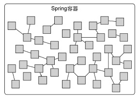
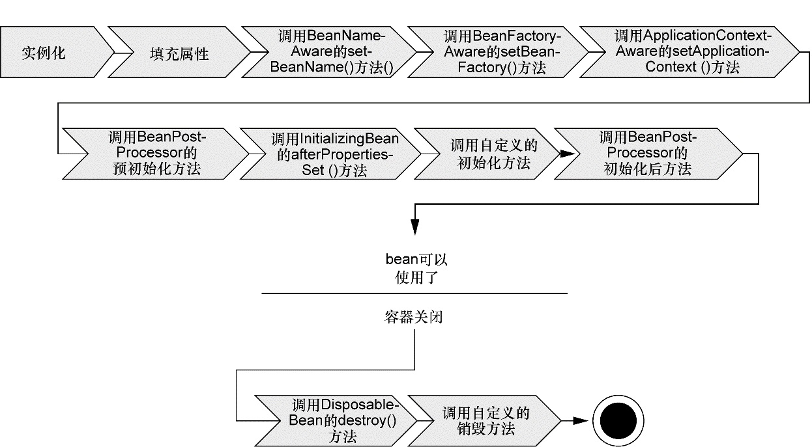

## 第一章 Spring之旅

1. 很多框架通过强迫应用继承它们的类或实现它们的接口从而导致应用与框架绑死，Spring 竭力避免因自身的 API 而弄乱你的应用代码。Spring 不会强迫你实现 Spring 规范的接口或继承 Spring 规范的类，相反，在基于 Spring 构建的应用中，它的类通常没有任何痕迹表明你使用了 Spring。

2. 耦合具有两面性（two-headed beast）。一方面，紧密耦合的代码难以测试、难以复用、难以理解，并且典型地表现出 “打地鼠” 式的 bug 特性（修复一个 bug，将会出现一个或者更多新的 bug）。另一方面，一定程度的耦合又是必须的 —— 完全没有耦合的代码什么也做不了。

3. 通过 DI，对象的依赖关系将由系统中负责协调各对象的第三方组件在创建对象的时候进行设定。对象无需自行创建或管理它们的依赖关系，依赖关系将被自动注入到需要它们的对象当中去。

4. 依赖注入的两种方式：构造器注入与setter注入。

5. 创建应用组件之间协作的行为通常称为装配。

6. Spring 通过应用上下文（Application Context）装载 bean 的定义并把它们组装起来。Spring 应用上下文全权负责对象的创建和组装。

7. 面向切面编程（aspect-oriented programming，AOP）允许你把遍布应用各处的功能分离出来形成可重用的组件。

8. Spring 旨在通过模板封装来消除样板式代码。

9. 在基于 Spring 的应用中，你的应用对象生存于 Spring 容器（container） 中，Spring 容器负责创建对象，装配它们，配置它们并管理它们的整个生命周期，从生存到死亡（在这里，可能就是 new 到 finalize()）。

   

10. 容器是 Spring 框架的核心。Spring 容器使用 DI 管理构成应用的组件，它会创建相互协作的组件之间的关联。

11. Spring 容器并不是只有一个。Spring 自带了多个容器实现，可以归为两种不同的类型。bean 工厂（由 org.springframework.beans.factory.BeanFactory 接口定义）是最简单的容器，提供基本的 DI 支持。应用上下文（由 org.springframework.context.ApplicationContext 接口定义）基于 BeanFactory 构建，并提供应用框架级别的服务，例如从属性文件解析文本信息以及发布应用事件给感兴趣的事件监听者。

12. Spring 自带了多种类型的应用上下文。

    - AnnotationConfigApplicationContext：从一个或多个基于 Java 的配置类中加载 Spring 应用上下文。
    - AnnotationConfigWebApplicationContext：从一个或多个基于 Java 的配置类中加载 Spring Web 应用上下文。
    - ClassPathXmlApplicationContext：从类路径下的一个或多个 XML 配置文件中加载上下文定义，把应用上下文的定义文件作为类资源。
    - FileSystemXmlapplicationcontext：从文件系统下的一 个或多个 XML 配置文件中加载上下文定义。
    - XmlWebApplicationContext：从 Web 应用下的一个或多个 XML 配置文件中加载上下文定义。

13. Spring Bean的声明周期：

    

    1. Spring 对 bean 进行实例化；

    2. Spring 将值和 bean 的引用注入到 bean 对应的属性中；

    3. 如果 bean 实现了 BeanNameAware 接口，Spring 将 bean 的 ID 传递给 setBeanName()方法；

    4. 如果 bean 实现了 BeanFactoryAware 接口，Spring 将调用  setBeanFactory() 方法，将 BeanFactory 容器实例传入；

    5. 如果 bean 实现了 ApplicationContextAware 接口，Spring 将调用 setApplicationContext() 方法，将 bean 所在的应用上下文的引用传入进来；

    6. 如果 bean 实现了 BeanPostProcessor 接口，Spring 将调用它们的 postProcessBefore-Initialization() 方法；

    7. 如果 bean 实现了 InitializingBean 接口，Spring 将调用它们的 afterPropertiesSet() 方法。类似地，如果 bean 使用 initmethod 声明了初始化方法，该方法也会被调用；

    8. 如果 bean 实现了 BeanPostProcessor 接口，Spring 将调用它们的 postProcessAfter-Initialization() 方法；

    9. 此时，bean 已经准备就绪，可以被应用程序使用了，它们将一直驻留在应用上下文中，直到该应用上下文被销毁；

    10. 如果 bean 实现了 DisposableBean 接口，Spring 将调用它的 destroy() 接口方法。

