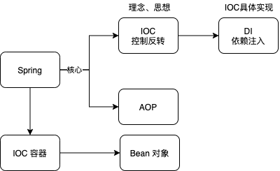
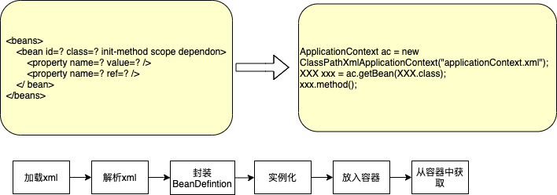
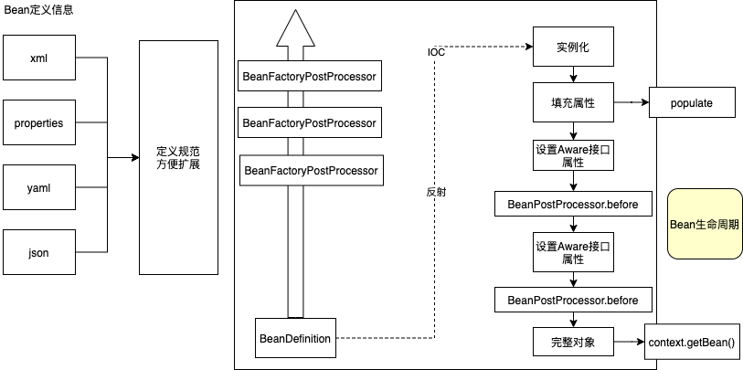
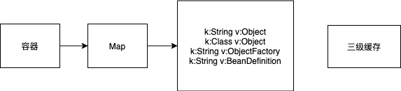

##  Spring

Spring是什么？

​	框架、生态（Spring -> SpringBoot -> Spring Cloud等）、IOC容器

基本架构：

类加载宏观流程：

Bean生命周期：

容器是什么？

​	

Spring 容器对象：

	1. 普通对象：即自定义对象。
	2. 容器对象：内置对象，Spring运行所需的对象。

创建对象两大步骤区分 实例化 与 初始化：

	1. 实例化： 即在内存中开辟一块空间，对象的属性值都是默认值。
	2. 初始化：给对象的属性赋值，包括填充属性与执行初始化方法(init-method)

Bean的作用域： singleton、prototype、request、session

重点接口：

 1. PostProcessor:

    1. BeanFactoryPostProcessor： 增强beanDefinition信息。
    2. BeanPostProcessor： 增强Bean信息。

	2. BeanFactory

	3. Aware

	4. BeanDefinition

	5. BeanDefinitionReader

	6. BeanFactoryPostProcessor

	7. BeanPostProcessor

	8. Environment

    1. StandardEnviroment
       1. System.getEnv()
       2. System.getProperties()

	9. FactoryBean: IsSingleton(), getObject(), getObjectType()

    注：BeanFactory与FactoryBean的区别：

    ​	都是用来创建对象的。当使用BeanFactory的时候必须要遵循完整的创建过程，这个过程是有Spring来管理控制的。而使用FactoryBean只需要调用getObject()就可以返回具体的对象，整个对象的创建过程是由用户自己来控制的，更加灵活。

Aware接口有什么用？

​	当Spring容器创建的bean对象在进行具体操作的时候，如果需要容器的其他对象（特指内置对象），此时可以将对象实现Aware接口，来满足当前的需要。
