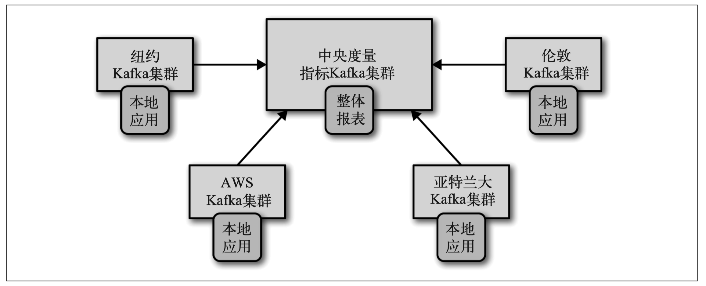
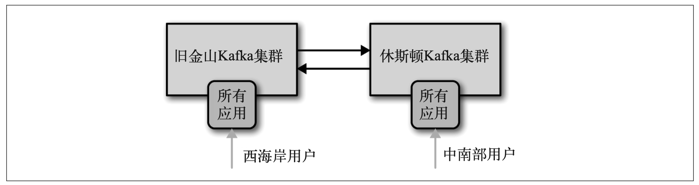
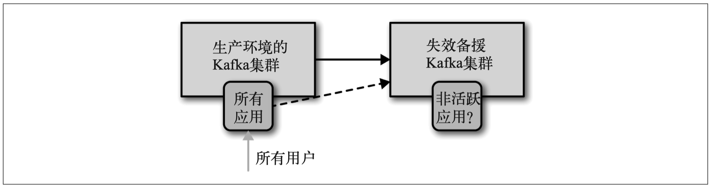

## 第08章 跨集群数据镜像

1. 大多数情况下，我们要避免向远程的数据中心生成数据，但如果这么做了，那么就要忍受 高延迟，并且需要通过增加重试次数和增大缓冲区来解决潜在的网络分区问题

2. 架构原则：

   1. 每个数据中心至少需要一个集群。
   2. 每两个数据中心之间的数据复制要做到每个事件仅复制一次（除非出现错误需要重试）。
   3. 如果有可能，尽量从远程数据中心读取数据，而不是向远程数据中心写入数据。

3. Hub和Spoke架构——构适用于一个中心 Kafka 集群对应多个本地 Kafka 集群的情况

   

   单向复制。一个数据中心的应用程序无法访问另一个数据 中心的数据。每个区域数据中心的数据都需要被镜像到中央数据中心上。镜像进程 会读取每一个区域数据中心的数据，并将它们重新生成到中心集群上。如果多个数据中心 出现了重名的主题，那么这些主题的数据可以被写到中心集群的单个主题上，也可以被写 到多个主题上。

4. 双活架构

   

   当有两个或多个数据中心需要共享数据并且每个数据中心都可以生产和读取数据时，可以 使用双活（Active-Active）架构可以为就近的用户提供服务，具有性能上的优势，而且不会 因为数据的可用性问题。问题：如何在进行多个位置的数据异步读取和异步更新时避免冲突。如果能够很好地处理在从多个位置异步读取数据和异步更新数据时发生的冲突问题，那么 我们强烈建议使用这种架构。这种架构是我们所知道的最具伸缩性、弹性、灵活性和成本 优势的解决方案。

5. 主备架构

   

   使用多个集群只是为了达到灾备的目的。，平常只使用其中的一个。当提供服务的集群完全不可用时， 就可以使用第二个集群。目前的 Kafka 镜像解 决方案无法为主集群和灾备集群保留偏移量。核心问题：主集群与灾备集群无法保证完全一致

6. 延展集群

   目前的 Kafka 镜像解 决方案无法为主集群和灾备集群保留偏移量。（同一个集群的Kafka分布在多个数据中心）延展集群与其他类型的集群有本质上的区别。 首先， 延展集群并非多个集群， 而是单个 集群， 因此不需要对延展集群进行镜像。 延展集群使用 Kafka 内置的复制机制在集群的 broker 之间同步数据。同步复制功能要求使用机架信息，确保每个分区 在其他数据中心都存在副本，还需要配置 min.isr 和 acks=all，确保每次写入消息时都可 以收到至少两个数据中心的确认。

7. Kafka 提 供 了 一 个 简 单 的 工 具， 用 于 在 两 个 数 据 中 心 之 间 镜 像 数 据。 这 个 工 具 叫 MirrorMaker， 它包含了一组消费者（因为历史原因， 它们在 MirrorMaker 文档里被称为 流 ），这些消费者属于同一个群组，并从主题上读取数据。每个 MirrorMaker 进程都有一个 单独的生产者。镜像过程很简单：MirrorMaker 为每个消费者分配一个线程， 消费者从源 集群的主题和分区上读取数据，然后通过公共生产者将数据发送到目标集群上。默认情况 下，消费者每 60 秒通知生产者发送所有的数据到 Kafka， 并等待 Kafka 的确认。然后消费 者再通知源集群提交这些事件相应的偏移量。

8. MirrorMaker 是高度可配置的。基本命令行参数：

   1. consumer.config：指定消费者的配置文件。所有的消费者将共用这个配置，也就是说，只能配 置一个源集群和一个 group.id。 所有的消费者属于同一个消费者群组。 配置文件里有两个必选的参数：bootstrap.servers（源集群的服务 器地址）和 group.id。reset 参数一般需要进行修改， 默认值是 latest，需要把该参数设为 earliest。
   2. producer.config：该参数用于指定生产者的配置文件。配置文件里唯一必选的参数是 bootstrap.servers （目标集群的服务器地址）。
   3. new.consumer：
   4. MirrorMaker 只能使用 为它更加稳定。0.8版本或者0.9版本的消费者。
   5. num.streams：一个流就是一个消费者
   6. whitelist：这是一个正则表达式， 代表了需要进行镜像的主题名字。 所有与表达式匹配的主题都 将被镜像。

9. MirrorMaker有一个 -deamon 命令行参数。理论上，只要使用这个参数就能实现后台 运行，不需要再做其他任何事情

10. 在 Docker 容 器 里 运 行 MirrorMaker 变 得 越 来 越 流 行。 MirrorMaker 是 完 全 无 状 态 的， 也不需要磁盘存储（所有的数据和状态都保存在 Kafka 上）。 将 MirrorMaker 安 装 在 Docker 里， 就 可 以 实 现 在 单 台 主 机 上 运 行 多 个 MirrorMaker 实 例。 因 为 单 个 MirrorMaker 实例的吞吐量受限于单个生产者， 所以为了提升吞吐量， 需要运行多个 MirrorMaker 实例

11. 尽量让 MirrorMaker 运行在目标数据中心里，远程读取比远 程生成更加安全

12. 如果需要加密传输数据需要在本地读取消息并将其生成到远程数据中心

13. rorMaker 部署到生产环境时，最好要对以下几项内容进行监控：

    1. 延迟监控：检查生产者或者消费者的偏移量，但都不是完美的解决方案。
    2. 度量指标监控：
       1. 消费者：fetch-size-avg、fetch-size-max、fetch-rate、fetch-throttle-time-avg 、fetch-throttle-time-max。
       2. 生产者：batch-size-avg、 batch-size-max 、requests-in-flight 以及 record-retry-rate。
       3. 同时适用于两者：io-ratio 和 io-wait-ratio。
    3. canary

14. Kafka 提供了 kafka-performance-producer 工具， 用于在 源集群上制造负载， 然后启动 MirrorMaker 对这个负载进行镜像。如果数据经过压缩，那么 MirrorMaker 还要负责解压并重新压缩 这些数据。

15. 如果 MirrorMaker 是跨数据中心运行的，可以在 Linux 上对网络进行优化。：

    1. 增加 TCP 的缓冲区大小（net.core.rmem_default、net.core.rmem_max、net.core.wmem_ default、net.core.wmem_max、net.core.optmem_max）。
    2. 启用时间窗口自动伸缩（sysctl –w net.ipv4.tcp_window_scaling=1 或者把 net.ipv4. tcp_window_scaling=1 添加到 /etc/sysctl.conf） 。
    3. 减少 TCP 慢启动时间（将 /proc/sys/net/ipv4/tcp_slow_start_after_idle 设为 0）。

16. 如果 MirrorMaker 的大部分时间用在轮询上， 那么说明消费者出现了瓶颈，如果大部分时间用在发送上，那么就是生产者出现了瓶颈。如果需要对生产者进行调优，可以使用下列参数：

    1. max.in.flight.requests.per.connection：默认情况下， MirrorMaker 只允许存在一个处理中的请求。 也就是说， 生产者在发送 下一个消息之前， 当前发送的消息必须得到目标集群的确认。如果不在乎消息的次序， 那么可以通过增加 max.in.flight. requests.per.connection 的值来提升吞吐量。
    2. linger.ms 和 batch.size：如果在进行监控时发现生产者总是发送未填满的批次（比如，度量指标 batch-size-avg 和 batch-size-max 的值总是比 batch.size 低），那么就可以通过增加一些延迟来提升吞 吐量。通过增加 latency.ms 可以让生产者在发送批次之前等待几毫秒，让批次填充更 多的数据。如果发送的数据都是满批次的，同时还有空余的内存，那么可以配置更大的 batch.size，以便发送更大的批次。
    3. range：MirrorMaker 默认使用 range 策略（用于确定将哪些分区分配给哪个消费者的 算法）进行分区分配。对于 MirrorMaker 来说，最好可以把策略改为 round robin，特别是在镜像大量的主题和分区的时候。要将策略改为 round robin 算法， 需要在消费者配置属性文件里加上 partition.assignment.strategy=org.apache.kafka. clients.consumer.RoundRobinAssignor。
    4. fetch.max.bytes：如果度量指标显示 fetch-size-avg 和 fetch-size-max 的数值与 fetch.max.bytes 很接近，说明消费者读取的数据已经接近上限。如果有更多的可用内存，可 以配置更大的 fetch.max.bytes，消费者就可以在每个请求里读取更多的数据。

17. fetch.min.bytes 和 fetch.max.wait：如果度量指标 fetch-rate 的值很高， 说明消费者 发送的请求太多了， 而且获取不到足够的数据。 这个时候可以配置更大的 fetch.min. bytes 和 fetch.max.wait， 这样消费者的每个请求就可以获取到更多的数据， broker 会 等到有足够多的可用数据时才将响应返回。

