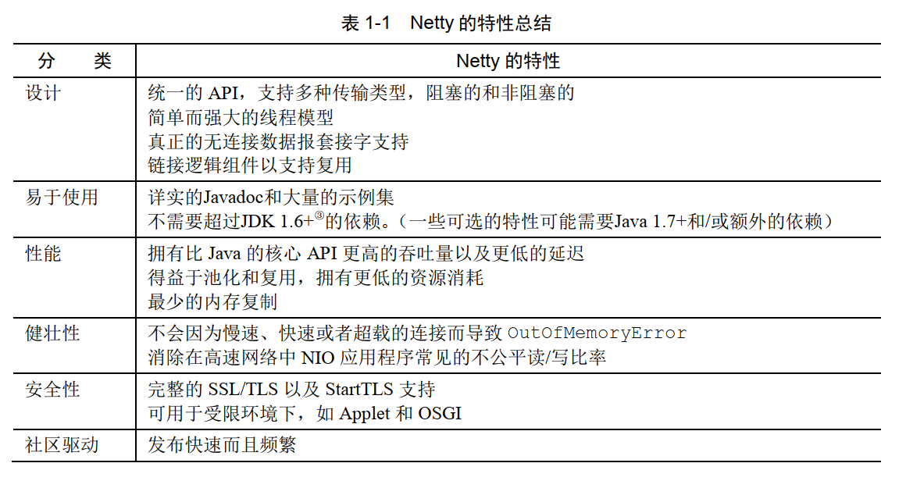

## 第一章 Netty——异步和事件驱动

1. Netty 是一款异步的事件驱动的网络应用程序框架，支持快速地开发可维护的高性能的面向协议的服务器 和客户端。

2. class java.nio.channels.Selector 是Java 的非阻塞 I/O 实现的关键。它使用了事件通知 API以确定在一组非阻塞套接字中有哪些已经就绪能够进行 I/O 相关的操作。  

3. 可伸缩性 ：一种系统、 网络或者进程在需要处理的工作不断增长时， 可以通过某种可行的方式或者扩大它的处理能力来适应这种增长的能力。  

4. 异步方法会立即返回，并且在它完成时，会直接或者在稍后的某个时间点通知用户。 

5. Netty核心组件：

   1. Channel：Channel是Java NIO的一个基本构造。它代表一个实体（如一个硬件设备、一个文件、一个网络套接字或者一个能够执行一个或者一个能够执行一行或者多个不同的I/O操作的程序组件）的开放连接，如读操作和写操作。目前，可以把Channel看作是传入或者传出数据的载体。因此，它可以被打开或者被关闭，连接或者断开连接。

   2. 回调：一个回调其实就是一个方法，一个指向已经被提供给另外一个方法的方法的引用。这使得后者可以在适当的时候调用前者。Netty在内部使用了回调来处理事件，当一个回调被触发时，相关的事件可以被一个interfaceChannelHandler的实现处理。

   3. Future：Future提供了另一种在操作完成时通知应用程序的方式。这个对象可以看作是一个异步操作的结果占位符；它将在将来的某个时刻完成，并提供对其结果的访问。JDK 预置了 interface java.util.concurrent.Future，但是其所提供的实现，只允许手动检查对应的操作是否已经完成，或者一直阻塞直到它完成。Netty提供了它自己的实现——ChannelFuture，用于在执行异步操作的时候使用。

      ChannelFuture提供了几种额外的方法，这些方法使得我们能够注册一个或者多个ChannelFutureListener实例。监听器的回调方法operationComplete()， 将会在对应的操作完成时被调用 。

   4. 事件和ChannelHandler：Netty 使用不同的事件来通知我们状态的改变或者是操作的状态。这使得我们能够基于已经发生的事件来触发适当的动作。  

   这些构建块代表了不同类型的构造：资源、逻辑和通知。

6. Netty 通过触发事件将 Selector 从应用程序中抽象出来，消除了所有本来将需要手动编写的派发代码。 在内部，将会为每个 Channel 分配一个 EventLoop， 用以处理所有事件 。EventLoop 本身只由一个线程驱动，其处理了一个 Channel 的所有 I/O 事件，并且在该EventLoop 的整个生命周期内都不会改变。  
7. 
