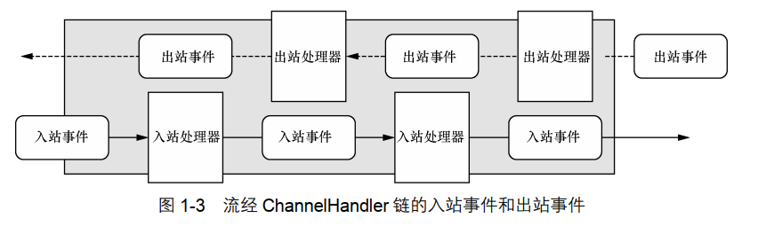

## 第二章 你的第一个Netty应用程序

1. 所有的 Netty 服务器都需要以下两部分。
   - 至少一个 ChannelHandler—该组件实现了服务器对从客户端接收的数据的处理，即
     它的业务逻辑。
   - 引导——这是配置服务器的启动代码。至少，它会将服务器绑定到它要监听连接请求的
     端口上。
2. 实现 ChannelInboundHandler 接口， 可以定义响应入站事件的方法。  
3. ChannelInboundHandlerAdapter 类提供了 ChannelInboundHandler 的默认实现。 ChannelInboundHandlerAdapter 有一个直观的 API，并且它的每个方法都可以被重写以挂钩到事件生命周期的恰当点上。  
4. 每个 Channel 都拥有一个与之相关联的 ChannelPipeline，其持有一个 ChannelHandler 的实例链。在默认的情况下， ChannelHandler 会把对它的方法的调用转发给链中的下一个 ChannelHandler。因此，如果exceptionCaught()方法没有被该链中的某处实现，那么所接收的异常将会被传递到 ChannelPipeline 的尾端并被记录。  
5. 当一个新的连接被接受时，一个新的子 Channel 将会被创建，而 ChannelInitializer 将会把一个你的EchoServerHandler 的实例添加到该 Channel 的 ChannelPipeline 中。  
6. 对 sync()方法的调用将导致当前 Thread阻塞，一直到绑定操作完成为止。
7. 7. 
