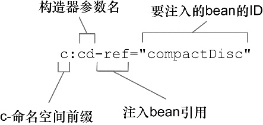
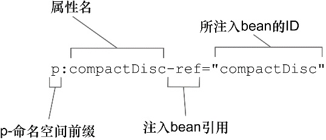

## 第二章 装配Bean

1. 创建应用对象之间协作关系的行为通常称为装配（wiring），这也是依赖注入（DI）的本质。

2. Spring 具有非常大的灵活性，它提供了三种主要的装配机制：
   - 在 XML 中进行显式配置。
   - 在 Java 中进行显式配置。
   - 隐式的 bean 发现机制和自动装配。
   
3. Spring 从两个角度来实现自动化装配：
   - 组件扫描（component scanning）：Spring 会自动发现应用上下文中所创建的 bean。
   - 自动装配（autowiring）：Spring 自动满足 bean 之间的依赖。
   
4. @Component 注解表明该类会作为组件类，并告知 Spring 要为这个类创建 bean。

5. 组件扫描默认是不启用的，显式配置一下 Spring，@ComponentScan 注解启用组件扫描，如果没有其他配置的话，@ComponentScan 默认会扫描与配置类相同的包。

6. 在 @ComponentScan 的 value 属性中可以指明要扫描的包的名称，如果你想更加清晰地表明你所设置的是基础包，那么你可以通过 basePackages 属性进行配置。

7. 除了将包设置为简单的 String 类型之外，@ComponentScan 还提供了另外一种方法，使用basePackageClasses指定为包中所包含的类或接口，basePackageClasses 属性所设置的数组中包含了类。这些类所在的包将会作为组件扫描的基础包。

8. 简单来说，自动装配就是让 Spring 自动满足 bean 依赖的一种方法，在满足依赖的过程中，会在 Spring 应用上下文中寻找匹配某个 bean 需求的其他 bean。为了声明要进行自动装配，我们可以借助 Spring 的 @Autowired 注解。

9. @Autowired 注解不仅能够用在构造器上，还能用在属性的 Setter 方法上。不管是构造器、Setter 方法还是其他的方法，Spring 都会尝试满足方法参数上所声明的依赖。

10. @Autowired 的 required 属性设置为 false表示此依赖是非必须装配的。

11. @Inject 注解来源于Java 依赖注入规范，该规范同时还为我们定义了 @Named 注解。在自动装配中，Spring 同时支持 @Inject 和 @Autowired。尽管 @Inject 和 @Autowired 之间有着一些细微的差别，但是在大多数场景下，它们都是可以互相替换的。

12. 如果你更倾向于使用 XML 来启用组件扫描的话，那么可以使用 Spring context 命名空间的元素component-scan。

13. Spring 的 SpringJUnit4ClassRunner可以在测试开始的时候自动创建 Spring 的应用上下文。注解 @ContextConfiguration 会告诉它加载配置的位置。

14. StandardOutputStreamLog，这是来源于 System Rules 库 的一个 JUnit 规则，该规则能够基于控制台的输出编写断言。

15. Spring 应用上下文中所有的 bean 都会给定一个 ID，默认为类名的第一个字母变为小写。如果想为 bean 设置不同的 ID，所要做的就是将期望的 ID 作为值传递给 @Component 注解。还有另外一种为 bean 命名的方式，这种方式不使用 @Component 注解，而是使用 Java 依赖注入规范（Java Dependency Injection）中所提供的 @Named 注解来为 bean 设置 ID。

16. Spring 支持将 @Named 作为 @Component 注解的替代方案。两者之间有一些细微的差异，但是在大多数场景中，它们是可以互相替换的。

17. 创建 JavaConfig 类的关键在于为其添加 @Configuration 注解，@Configuration 注解表明这个类是一个配置类，该类应该包含在 Spring 应用上下文中如何创建 bean 的细节。

18. 要在 JavaConfig 中声明 bean，我们需要编写一个方法，这个方法会创建所需类型的实例，然后给这个方法添加 @Bean 注解。

19. @Bean 注解会告诉 Spring 这个方法将会返回一个对象，该对象要注册为 Spring 应用上下文中的 bean。默认情况下，bean 的 ID 与带有 @Bean 注解的方法名是一样的。如果你想为其设置成一个不同的名字的话，那么可以重命名该方法，也可以通过 name 属性指定一个不同的名字。

20. 在 JavaConfig 中装配 bean 的最简单方式就是引用创建 bean 的方法。也可以在方法中通过参数将所依赖的对象传递进来。

21. 方法上添加了 @Bean 注解， Spring 将会拦截所有对它的调用，并确保直接返回该方法所创建的 bean，而不是每次都对其进行实际的调用。

22. 可以将同一个实例注入到任意数量的其他 bean 之中。默认情况下，Spring 中的 bean 都是单例的。

23. 在使用 XML 为 Spring 装配 bean 之前，你需要创建一个新的配置规范。在使用 JavaConfig 的时候，这意味着要创建一个带有 @Configuration 注解的类，而在 XML 配置中，这意味着要创建 一个 XML 文件，并且要以元素为根。

24. 用来装配 bean 的最基本的 XML 元素包含在 spring-beans 模式之中，在上面这个 XML 文件中，它被定义为根命名空间。是该模式中的一个元素，它是所有 Spring 配置文件的根元素。

25. 要在基于 XML 的 Spring 配置中声明一个 bean，我们要使用 springbeans 模式中的另外一个元素：`<bean>`。如果没有明确给定 ID，所以这个 bean 将会根据全限定类名+#+数字来进行命名。通常来讲更好的办法是借助 id 属性，为每个 bean 设置一个你自己选择的名字。当 Spring 发现这个元素时，它将会调用 SgtPeppers 的默认构造器来创建bean。

26. 在 Spring XML 配置中，只有一种声明 bean 的方式：使用 `<bean>` 元素并指定 class 属性。Spring 会从这里获取必要的信息来创建 bean。

27. 在 XML 中声明 DI 时，会有多种可选的配置方案和风格。具体到构造器注入，有两种基本的配置方案可供选择：

    - `<constructor-arg>` 元素
    - 使用 Spring 3.0 所引入的 `c-` 命名空间

28. `c-` 命名空间是在 Spring 3.0 中引入的，它是在 XML 中更为简洁地描述构造器参数的方式。要使用它的话，必须要在 XML 的顶部声明其模式。

    

29. 也可以使用参数在整个参数列表中的位置信息，如_0。

30. 使用 `<constructor-arg>` 元素进行构造器参数的注入时，使用了value 属表明给定的值要以字面量的形式注入到构造器之中。如果要使用 `c-` 命名空间的话，去掉了`-ref` 后缀。

31. `<null/>` 元素所做的事情：将 null 传递。`<set>` 或 `<list>` 都可以用来装配 List、Set 甚至数组。`<constructor-arg>` 比 `c-` 命名空间的属性更有优势。目前，使用 `c-` 命名空间的属性无法实现装配集合的功能。

32. 对强依赖使用构造器注入，而对可选性的依赖使用属性注入。

33. `<property>` 元素为属性的 Setter 方法所提供的功能与 `<constructor-arg>` 元素为构造器所提供的功能是一样的。Spring 提供了更加简洁的 `p-` 命名空间，作为 `<property>` 元素的替代方案。

    

34. 属性也可以注入字面量，这与构造器参数非常类似。不能使用 `p-` 命名空间来装配集合，没有便利的方式使用 `p-` 命名空间来指定一个值（或 bean 引用）的列表。可以使用 Spring `util-` 命名空间中的一些功能来简化.

35. `util-` 命名空间所提供的功能之一就是元素，它会创建一个列表的 bean。提供的元素如下：

    + util:constant 引用某个类型的 public static 域，并将其暴露为 bean
    + util:list 创建一个 java.util.List 类型的 bean，其中包含值或引用
    + util:map 创建一个 java.util.Map 类型的 bean，其中包含值或引用
    + util:properties 创建一个 java.util.Properties 类型的 bean
    + util:property-path 引用一个 bean 的属性（或内嵌属性），并将其暴露为 bean
    + util:set 创建一个 java.util.Set 类型的 bean，其中包含值或引用
    
36. Java配置中可以使用 @Import 注解导入 其他配置类，可以在使用@ImportResource导入其他XML配置文件。

37. 在 XML 中，我们可以使 用 import 元素来拆分 XML 配置。`<import>` 元素只能导入其他的 XML 配置文件，并没有 XML 元素能够导入 JavaConfig 类。`<bean>` 元素够用来将 Java 配置导入到 XML 配置中。
