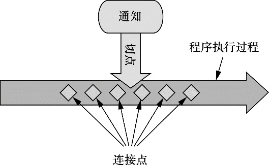
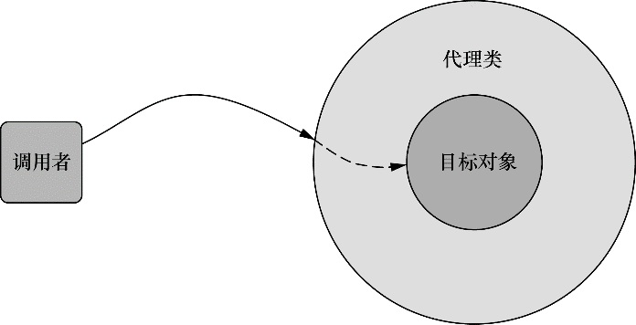
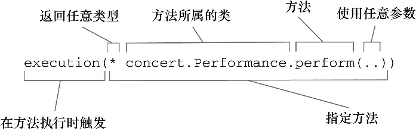
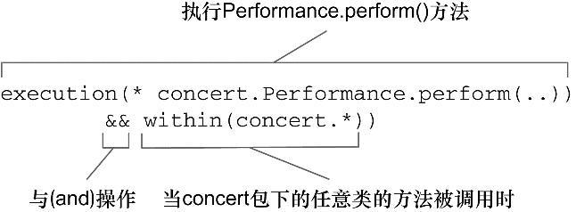

## 第四章 面向切面的Spring

1. 在软件开发中，散布于应用中多处的功能被称为横切关注点。横切关注点可以被模块化为特殊的类，这些类被称为切面（aspect）。

2. 在使用面向切面编程时，我们仍然在一个地方定义通用功能，但是可以通过声明的方式定义这个功能要以何种方式在何处应用，而无需修改受影响的类。

3. AOP概念图：

   

4. AOP术语：

   1. 通知：在 AOP 术语中，切面的工作被称为通知。通知定义了切面是什么以及何时使用。除了描述切面要完成的工作，通知还解决了何时执行这个工作的问题。Spring 切面可以应用 5 种类型的通知：

      - 前置通知（Before）：在目标方法被调用之前调用通知功能；
      - 后置通知（After）：在目标方法完成之后调用通知，此时不会关心方法的输出是什么；
      - 返回通知（After-returning）：在目标方法成功执行之后调用通 知；
      - 异常通知（After-throwing）：在目标方法抛出异常后调用通知；
      - 环绕通知（Around）：通知包裹了被通知的方法，在被通知的方法调用之前和调用之后执行自定义的行为。

   2. 连接点：我们的应用可能也有数以千计的时机应用通知。这些时机被称为连接点。连接点是在应用执行过程中能够插入切面的一个点。这个点可以是调用方法时、抛出异常时、甚至修改一个字段时。切面代码可以利用这些点插入到应用的正常流程之中，并添加新的行为。

   3. 切点：如果说通知定义了切面的“什么”和“何时”的话，那么切点就定义了“何处”。切点的定义会匹配通知所要织入的一个或多个连接点。我们通常使用明确的类和方法名称，或是利用正则表达式定义所匹配的类和方法名称来指定这些切点。有些 AOP 框架允许我们创建动态的切点，可以根据运行时的决策（比如方法的参数值）来决定是否应用通知。

   4. 切面： 切面是通知和切点的结合。通知和切点共同定义了切面的全部内容 —— 它是什么，在何时和何处完成其功能。

   5. 引入：引入允许我们向现有的类添加新方法或属性。从而可以在无需修改这些现有的类的情况下，让它们具 有新的行为和状态。

   6. 织入：织入是把切面应用到目标对象并创建新的代理对象的过程。切面在指定的连接点被织入到目标对象中。在目标对象的生命周期里有多个点可以进行织入：

      - 编译期：切面在目标类编译时被织入。这种方式需要特殊的编译器。AspectJ 的织入编译器就是以这种方式织入切面的。
      - 类加载期：切面在目标类加载到 JVM 时被织入。这种方式需要特殊的类加载器（ClassLoader），它可以在目标类被引入应用之前增强该目标类的字节码。AspectJ 5 的加载时织入（load-time weaving，LTW）就支持以这种方式织入切面。
      - 运行期：切面在应用运行的某个时刻被织入。一般情况下，在织入切面时，AOP 容器会为目标对象动态地创建一个代理对象。Spring AOP 就是以这种方式织入切面的。

   7. Spring 提供了 4 种类型的 AOP 支持：

      - 基于代理的经典 Spring AOP；
      - 纯 POJO 切面；
      - @AspectJ 注解驱动的切面；
      - 注入式 AspectJ 切面（适用于 Spring 各版本）。

   8. Spring AOP 构建在动态代理基础之上，因此，Spring 对 AOP 的支持局限于方法拦截。

   9. Spring 借鉴了 AspectJ 的切面，以提供注解驱动的 AOP。本质上，它依然是 Spring 基于代理的 AOP，但是编程模型几乎与编写成熟的 AspectJ 注解切面完全一致。这种 AOP 风格的好处在于能够不使用 XML 来完成功能。 如果你的 AOP 需求超过了简单的方法调用（如构造器或属性拦截），那么你需要考虑使用 AspectJ 来实现切面。

   10. Spring 所创建的通知都是用标准的 Java 类编写的。

   11. Spring在运行时通知对象:

       

       通过在代理类中包裹切面，Spring 在运行期把切面织入到 Spring 管理的 bean 中。如果使用的是 ApplicationContext 的话，在 ApplicationContext 从 BeanFactory 中加载所有 bean 的时候，Spring 才会创建被代理的对象。因为 Spring 运行时才创建代理对象，所以我们不需要特殊的编译器来织入 Spring AOP 的切面。

   12. Spring 只支持方法级别的连接点:因为 Spring 基于动态代理，所以 Spring 只支持方法连接点。

   13. 在 Spring AOP 中，要使用 AspectJ 的切点表达式语言来定义切点。 Spring 仅支持 AspectJ 切点指示器（pointcut designator）的一个子集。

   14. 切入点表达式示例：

       

   15. Spring 还引入了一个新的 bean() 指示器，它允许我们在切点表达式中使用 bean 的 ID 来标识 bean。bean() 使用 bean ID 或 bean 名称作为参数来限制切点只匹配特定的 bean。
   
   16. Spring中，可以使用@Aspect注解将一个POJO定义为一个切面。在切面中，可以使用以下注解来定义切面的具体行为：
   
       | 注解            | 通知                                     |
       | --------------- | ---------------------------------------- |
       | @After          | 通知方法会在目标方法返回或抛出异常后调用 |
       | @AfterReturning | 通知方法会在目标方法返回后调用           |
       | @AfterThrowing  | 通知方法会在目标方法抛出异常后调用       |
       | @Around         | 通知方法会将目标方法封装起来             |
       | @Before         | 通知方法会在目标方法调用之前执行         |
   
   17. @Pointcut 注解能够在一个 @AspectJ 切面内定义可重用的切点。
   
   18. 要启动Spring的AOP功能，可以在Java配置类的类级别上通过使用 EnableAspectJAutoProxy 注解启用自动代理功能。如果要在XML中配置的话，使用 Spring aop 命名空间中的 `<aop:aspectj-autoproxy>` 元素。
   
   19. 利用被称为引入的 AOP 概念，切面可以为 Spring bean 添加新方法。
   
   20. @DeclareParents 注解由三部分组成：
   
       - value 属性指定了哪种类型的 bean 要引入该接口。在本例中，也就是所有实现 Performance 的类型。（标记符后面的加号表示是 Performance 的所有子类型，而不是 Performance 本身。）
       - defaultImpl 属性指定了为引入功能提供实现的类。在这里，我们指定的是 DefaultEncoreable 提供实现。
       - @DeclareParents 注解所标注的静态属性指明了要引入了接口。在这里，我们所引入的是 Encoreable 接口。
   
   21. 在 Spring 的 aop 命名空间中，提供了多个元素用来在 XML 中声明切面。
   
       | AOP配置元素               | 用途                                              |
       | ------------------------- | ------------------------------------------------- |
       | `<aop:advisor>`           | 定义 AOP 通知器                                   |
       | `<aop:after>`             | 定义 AOP 后置通知（不管被通知的方法是否执行成功） |
       | `<aop:after-returning>`   | 定义 AOP 返回通知                                 |
       | `<aop:after-throwing>`    | 定义 AOP 异常通知                                 |
       | `<aop:around>`            | 定义 AOP 环绕通知                                 |
       | `<aop:aspect>`            | 定义一个切面                                      |
       | `<aop:aspectj-autoproxy>` | 启用 @AspectJ 注解驱动的切面                      |
       | `<aop:before>`            | 定义一个 AOP 前置通知                             |
       | `<aop:config>`            | 顶层的 AOP 配置元素。大多数的元素必须包含在元素内 |
       | `<aop:declare-parents>`   | 以透明的方式为被通知的对象引入额外的接口          |
       | `<aop:pointcut>`          | 定义一个切点                                      |
   
   22. 关于 Spring AOP 配置元素，第一个需要注意的事项是大多数的 AOP 配置元素必须在 `<aop:config>` 元素的上下文内使用。
   
   23. 使用` <aop:aspect> `元素声明了一个的切面。ref 属性引用了一个容器中的 POJO bean。
   
   24. `<aop:pointcut> `元素定义了一个 id切点，在XML其他地方可以使用 pointcut-ref 属性来引用这个命名切点。如果想让定义的切点能够在多个切面使用，我们可以把 `<aop:pointcut>` 元素放在 `<aop:config> `元素的范围内。
   
   25. 前置通知和后置通知有一些限制。具体来说，如果不使用成员变量存储信息的话，在前置通知和后置通知之间共享信息非常麻烦。
   
   26. `<aop:declare-parents>` 声明了此切面所通知的 bean 要在它的对象层次结构中拥有新的父类型。具体到本例中，类型匹配 Performance 接口（由 types-matching 属性指定）的那些 bean 在父类结构中会增加 Encoreable 接口（由 implement-interface 属性指定）。最后要解决的问题是 Encoreable 接口中的方法实现要来自于何处。这里有两种方式标识所引入接口的实现。在本例中，我们使用 default-impl 属性用全限定类名来显式指定 实现。或者，我们还可以使用 delegate-ref 属性来标识。
   
   27. 通常情况下，Spring bean 由 Spring 容器初始化，但是 AspectJ 切面是由 AspectJ 在运行期创建的。等到 Spring 有机会为 CriticAspect 注入 CriticismEngine 时，CriticAspect 已经被实例化了。
   
   28. 通常情况下，Spring bean 由 Spring 容器初始化，但是 AspectJ 切面是由 AspectJ 在运行期创建的。等到 Spring 有机会为 CriticAspect 注入 CriticismEngine 时，CriticAspect 已经被实例化了。
   
   29. 