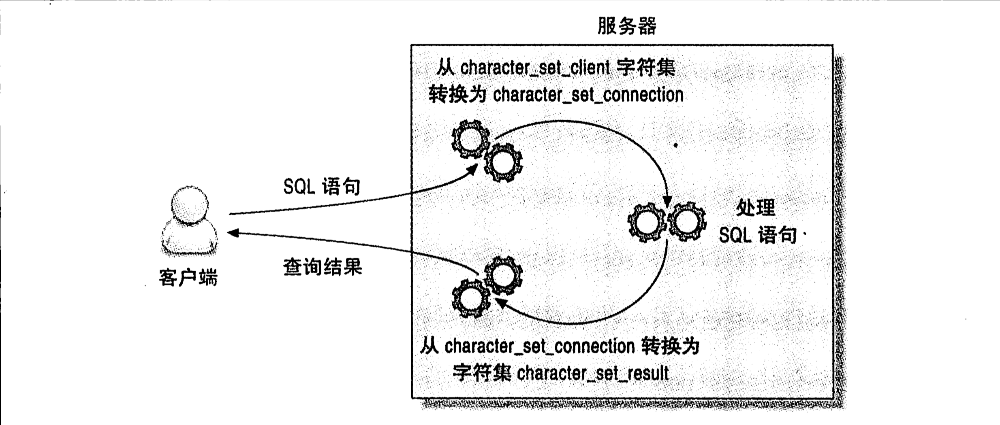
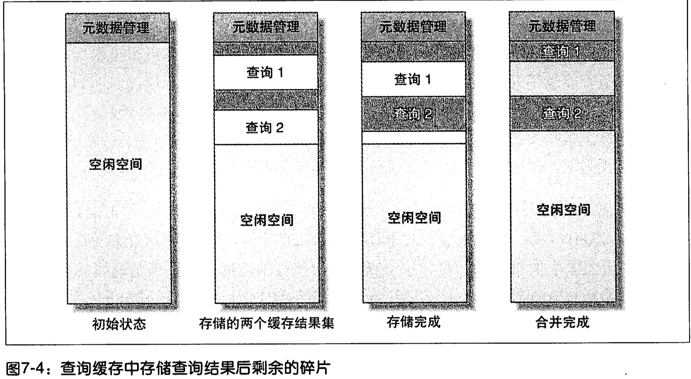

## 第七章 MySQL高级特性

1. 对用户来说，分区表是一个独立的逻辑表，但是底层有多个物理子表组成。实现分区的代码实际上是对一组底层表的句柄对象的封装。对分区表的请求，都会通过句柄对象转化成对存储引擎接口的接口调用。

2. MySQL实现分区表的方式——对底层表的封装——意味着索引也是按照分区的子表定义的，而没有全局索引。

3. MySQl在创建PARTITION BY子句定义每个分区表存放的数据。

4. 分区的一个主要目的是将数据按照一个较粗的粒度分布在不同的表中。

5. 使用场景：

   1. 表非常大一只鱼无法全部都存放在内存中，或者只在表的最后部分有热点数据，其他均是历史数据。
   2. 分区表的数据更容易维护。例如，想批量删除大量数据可以使用清除整个分区的方式。另外，还可以对一个独立分区进行优化、检查、修复等操作。
   3. 分区表的数据可以分布在不同的物理设备上，从而高效地利用多个硬件设备。
   4. 可以使用分区表来避免某些特殊的瓶颈，例如InnoDB的单个索引的互斥访问、ext3文件系统的inode锁竞争等。
   5. 如果需要，还可以备份和恢复独立的分区，这在非常大的数据集的场景下效果非常好

6. 分区表本身也有一些限制，下面是其中比较重要的几点：

   1. 一个表最多只能有1024个分区。
   2. 在MySQL5.1中，分区表达式必须是整数，或者是返回整数的表达式。在MySQL5.5中，某些场景可以直接使用列来进行分区。
   3. 如果分区字段中有主键或者唯一索引的列，那么所有主键和唯一索引列都必须包含进来。
   4. 分区表中无法使用外键约束。

7. 分区表由多个相关的底层表实现，这些底层表也是由句柄对象表示，所以我们也可以直接访问各个分区。存储引擎管理分区的各个底层表和管理普通表一样（所有底层都必须使用相同的存储引擎），分区表的索引只是在各个底层上各自加上一个完全相同的索引。

8. 分区表上的操作按照下面的操作逻辑进行：

   1. SELECT查询：当查询一个分区表的时候，分区层先打开并锁住所有的底层表，优化器先判断是否可以过滤部分分区，然后再调用对应的存储引擎接口访问各个分区的数据。
   2. INSERT操作：当写入一条记录时，分区层先打开并锁住所有的底层表，然后确定哪个分区接受这条记录，再将记录写入对应的底层表。
   3. DELETE操作：当删除一条记录时，分区层先打开并锁住所有的底层表，然后确定数据对应的分区，最厚对相应底层表进行删除操作。
   4. UPDATE操作：当更新一条记录时，分区层先打开并锁住所有的底层表，MySQL先确定需要更新的记录在哪个分区，然后取出数据并更新，再判断更新后的数据应该放在哪个分区，最后对底层表进行写入操作，并对原数据所在的底层表进行删除操作。

9. 虽然每个操作都会“先打开并锁住所有的底层表”，但这并不是说分区表在处理过程中时锁住全表的。如果存储引擎能够自己实现行级锁，例如InnoDB，则会在分区层释放对应的表锁。

10. MySQl支持多种分区表。最多的是根据范围进行分区，每个分区存储落在某个范围的记录，分区表达式可以是列，也可以是包含列的表达式。

11. PARTITION分区子句中可以使用各种函数。担忧一个要求，表达式返回的值要是一个确定的整数，且不能是一个常数。

12. MySQL还指出键值、哈希和列表分区，这其中有些还支持子分区，不够我们在生产环境中很少见到。

13. 系统通过子分区可降低索引的互斥访问的竞争。使用哈希子分区可用降数据切成多个小片，大大降低互斥量的竞争问题。

14. 其他的分区技术包括：

    1. 根据键值进行分区，来减少InnoDB的互斥量竞争。
    2. 使用数学模型来进行分区，然后将数据轮询放入不同的分区。
    3. 假设表有一个自增的主键id，希望根据时间将最近的热点数据集中存放。那么必须将时间戳包含在主键当中才行，而这和主键本身的意义相矛盾。这种情况下也可以使用这样的分区表达式来实现相同的目的：HASH（id DIV 1000000），这将为1000万数据建立一个分区。

15. 在数据量超大的时候，B-Tree索引就无法起作用了。

16. 理解分区时还可以将其当作索引的最初形态，以代价非常小的方式定位到需要的数据在哪一片“区域”。

17. 未来保证大数据量大可扩展性，一般有下面两个策略：

    1. 全量扫描数据，不要任何索引：可以使用简单的分区方式存放表，不要任何索引，根据分区的规则大致定为需要的数据位置。
    2. 索引数据，并分离热点：如果数据有明显的“热点”，而去除了这部分数据，其他数据很少被访问到，那么可以将这部分数据单独存放在一个分区中，让这个分区的数据能够有机会都缓存在内存中。

18. 分区·注意事项：

    1. NULL值会使分区过滤无效：关于分区表一个容易让人误解的地方是分区的表达式的值可以是NULL：第一个分区是一个特殊分区。为NULL或者是一个非法值的时候，记录都会被存放到第一个分区。
    2. 分区列和索引列不匹配：如果定义的索引列和分区列不匹配，会导致查询无法进行分区过滤。假设在a列上定义了索引，而在列b上进行了分区。因为每个分区都有其独立的索引，所以扫描列b上的索引就需要扫描每一个分区内对应的索引。
    3. 选择分区的成本可能很高：分区有很多类型，不同类型分区的实现方式不同，所以它们的性能也各不相同。尤其是范围分区，对于回答“这一行属于哪个分区”、“这些符合查询条件的行在那些分区”这样的问题的成本可能会非常高，因为服务器需要扫描所有的分区定义的列表来找到正确的答案。根据实践经验，对大多数系统来说，100个左右的分区是没有问题的。
    4. 打开并锁住所有底层表的成本可能很高：当查询访问分区表的时候，MySQL需要打开并锁住所有的底层表，这是分区表的另一个开销。可以用批量操作的方式来降低单个操作此类的开销。
    5. 维护分区的成本可能很高

19. 限制：

    1. 所有分区都必须使用相同的存储引擎。
    2. 分区函数中可以使用的函数和表达式也有一些限制。
    3. 某些存储引擎不支持分区
    4. 对于MyISAM的分区表，不能再使用LOAD INDEX INTO CACHE操作。
    5. 对于MyISAM表，使用分区表时需要打开更多的文件描述符。虽然看起来是一个表，其实背后有很多独立的分区，每一个分区对于存储引擎来说都是一个独立的表。这样即使分区表只占用了一个表的缓存条目，文件描述符还是需要多个。（会出现超过文件描述符限制的问题）

20. 对于访问分区表来说，很重要的一点是要在WHERE条件中带入分区列。

21. 使用EXPLAIN PARTITION可以观察优化器是否执行了分区过滤。

22. MySQL只能在使用分区函数的列本身进行比较时才能过滤分区，而不能根据表达式的值去过滤分区，即使这个表达式就是分区函数也不行。

23. 若分区表时关联操作中的第二张表，且关联条件时分区键，MySQL就只会在对应的分区里匹配行。

24. 合并表是一种早期的、简单的分区实现，和分区表相比有一些不同的限制，并且缺乏优化。分区表严格来说是一个逻辑上的概念，用户无法访问底层的各个分区，对用户来说分区是透明的。但是合并表允许用户单独访问各个子表。分区表的优化器的结合更紧密，这也是未来的发展趋势，而合并表则是一种将被淘汰的技术，在未来的版本中可能被删除。

25. 合并表相当于一个容器，里面包含了多个真实表。可以在CREATE TABLE中使用一种特别的UNION语法来制定包含哪些真实表（ENGINE=MERGE UNION=(t1, t2) INSERT_METHOD=LAST; 

26. 建立的合并表和前面的各个真实表字段完全相同，在合并表中有的索引各个真实子表也有，这是创建合并表的前提条件。

27. 合合并表中的每一个子表行为和表定义都是相同，但是合并表在全局上并不受这些限制条件。

28. 愈发INSERT_METHOD=LAST告诉MySQL，将所有的INSERT语句都发送给最后一个表。指定FIRST或者LAST关键字是唯一可以控制行插入到合并表的哪一个子表的方式（当然，还可以直接在SQL中明确地操作任何一个子表）

29. 删除一个合并表，它的子表不会受任何影响，而如果删除其中一个子表则可能会有不同的后果，这要视操作系统而定。

30. 合并表其他限制：

    1. 在使用CREATE语句创建一个合并表的时候，并不会检查各个子表的兼容性。如果子表的定义稍有不同，那么MySQL就可能创建出一个后面无法使用的合并表。
    2. 根据合并表的兼容性，不难发现，在合并表上无法使用REPLACE语法，无法使用自增字段。
    3. 如果一个查询访问合并表，那么它需要访问所有子表。

31. 还需要记住以下几点：

    1. 执行范围查询时，需要在每一个子表上各执行一次，这比直接访问单个表的性能要差很多，而去子表越多，性能越差。
    2. 全表扫描和普通表的速度相同。
    3. 在合并表上做唯一键和主键查询时，一旦找到一行数据就会停止。所以一旦查询在合并表的某一个子表中找到一行数据，就会立刻返回，不会再访问任何其他子表。
    4. 子表的顺序读取和CREATE TABLE语句中的顺序相同。

32. 合并表的各个子表可以直接被访问，所以它还有一些MySQL5.5分区所不能提供的特性：

    1. 一个MyISAM表可以是多个合并表的子表。
    2. 可以通过直接复制.frm、.MYI、.MYD文件，来实现在不同的服务器之间复制各个子表。
    3. 在合并表中可以很容易地添加新的子表：直接修改合并表的定义即可。
    4. 可以创建一个合并表，让它只包含需要的数据，例如只包含某些时间段的数据，而在分区表中是做不到这一点的。
    5. 如果像对某个子表做备份、恢复、修改、修复或者别对操作时，可以先将其从合并表中删除，操作结束后再将其加回去。
    6. 可以使用myisampack来压缩所有的子表。

33. 视图本身是一个虚拟表，不存放任何数据。在使用SQL语句访问视图的时候，它返回的数据是MySQL从其他表中生成的。视图和表是在同一命名空间，MySQL在很多地方对于视图和表是同样对待的。

34. MySQL可以使用两种算法中的任何一种来处理视图。分别称作合并算法和临时表算法。如果可能，会尽可能地使用合并算法。可以在EXPLAIN EXTENDED之后使用SHOW WARNINGS来查看使用视图的查询和重写后的结果。

35. 如果是采用临时表算法实现的视图，EXPLAIN中会显示为派生表（DERIVED）

36. 如果视图中包含GROUP BY、DISTINCT、任何聚合函数、UNION、子查询等，只要无法在原表记录和视图记录中建立一一映射等场景中，MySQL都将使用临时表算法来实现视图。如果你想确定MySQL到底是使用合并算法还是临时表算法，可以EXPLAIN一条针对视图的简单查询。

37. select_type为“DERIVED”，说明该视图是采用临时表算法实现的。如果产生的底层派生表很大，那么执行EXPLAIN可能会非常慢。因为在MySQL5.5和更老的版本中，EXPLAIN是需要执行并产生该派生表的。

38. 视图的实现算法是视图本身的属性，和作用在视图上的查询语句无关。例如，可以为一个基于简单查询的视图指定使用临时表算法。（ALGORITHM=TEMPTABLE）

39. 可更新视图是指可以通过更新这个视图来更新视图涉及的相关表。只要指定来合适的条件，就可以更新、删除甚至向视图中写入数据。

40. 如果视图定义中包含了GROUP BY、UNION、聚合函数以及其他一些特殊情况，就不能被更新了。更新视图的查询也可以是一个关联语句，但是有一个限制，被更新的列必须来自同一个表中。另外，所有使用临时表算法实现的视图都无法被更新。

41. CHECK OPTION子句，表示任何通过视图更新的行，都必须符合视图本身的WHERE条件定义。

42. MySQL不支持在视图上建立任何触发器。

43. 可以使用视图实现基于列的权限控制，却不需要真正的在系统中创建列权限，因此没有额外的开销。

44. MySQL不能创建只在当前连接中存在的真正的临时视图。

45. MySQL优化器可能无法做内外结合优化。

46. MySQL还不支持物化视图（物化视图是指将视图结果数据存放在一个可以查看的表中，并定期从原始表中刷新数据到这个表中）。MySQL也不支持在视图中创建索引。不过，可以使用构建缓存表或者汇总表的办法来模拟物化视图和索引。

47. MySQL并不会保存视图定义的原始SQL语句，所以如果打算通过执行SHOW CREATE VIEW后再简单地修改其结果的方式来重新定义视图，可能会大失所望。SHOW CREATE VIEW出来的视图创建语句将以一种不友好的内部形式呈现，充满了各种转义和引号，每个代码格式化，没有注释，也没有缩进。

48. InnoDB是目前MySQL中唯一支持外键的内置存储引擎，所遇如果需要外键支持那选择就不多了。

49. 使用外键是有成本的。比如外键通常都要求每次在修改数据时都要在另外一张表中多执行一次外检查找操作。虽然InnoDB强制外键使用索引，但还是无法消除这种约束检查的开销。

50. 如果想确保两个相关表始终有一致的数据，那么使用外键比在应用程序中检查一致性的性能要高得多，此外，外键在相关数据的删除和更新上，也比在应用中维护要更高效，不过，外键维护操作是逐行进行的，所以这样的更新会比批量删除和更新要慢一些。

51. 对于相关数据的同时更新外键更合适（及联更新），但是如果外键只是用作数值约束，那么触发器或者显式地限制取值会更好些。

52. 如果只是使用外键做约束，那通常在应用程序里实现该约束会更好。

53. MySQL允许通过触发器、存储过程和函数的形式来存储代码。

54. 存储过程和存储函数都可以接受参数然后返回值，但是触发器和事件却不行。

55. MySQL中使用存储代码的优点：

    1. 他在服务器内部执行，离数据最近，另外在服务器上执行还可以节省宽带和网络延迟。
    2. 这是一种代码重用。可以方便地统一业务规则，保证某些行为总是一致，所以也可以为应用提供一定的安全性。
    3. 她可以简化代码的维护和版本更新。
    4. 她可以帮助提升安全，比如提供更细粒度的权限控制。
    5. 服务器端可以缓存存储过程和执行计划，这对于需要反复调用的过程，会大大降低消耗。
    6. 因为是在服务器端部署的，所以备份、维护都可以在服务器端完成。
    7. 她可以在应用开发和数据库开发人员之间更好地分工。

56. 缺点：

    1. MySQL本身没有提供好用的开发和调试工具，所以编写MySQL的存储代码比其他的数据库要更难一些。
    2. 较之应用程序的代码，存储代码效率要稍微差些。
    3. 存储代码可能会给应用程序代码的部署带来额外的复杂性。
    4. 因为存储程序都部署在服务器内，所以可能有安全隐患。
    5. 存储过程会给数据库服务器增加额外的压力，而数据库服务器的扩展性比应用服务器要差很多。
    6. MySQL并没有什么选项可以控制存储程序的资源消耗，所以在存储过程中的一个小错误，可能直接把服务器拖死。
    7. 存储代码在MySQL中的实现也有很多限制——执行计划缓存是连接级别，游标的物化和临时表相同，在MySQL5.5版本之前，异常处理也非常困难。
    8. 调试MySQL的存储过程是一件很困难的事情。
    9. 它和基于语句的二进制日子复制合作得并不好。

57. 存储代码限制：

    1. 优化器无法使用关键字DETERMINISTIC来优化单个查询中多次调用存储函数的情况。
    2. 优化器无法评估存储函数的成本。
    3. 每个连接都有独立的存储过程的执行计划缓存。如果有多个连接需要调用同一个存储过程，将会浪费缓存空间来反复缓存同样的存执行计划。（如果使用的是连接池或者是持久化连接，那么执行计划缓存可能会有更长的生命周期）
    4. 存储程序的复制是一组诡异的组合。如果可以，最好不要复制对存储程序的调用。直接复制由存储程序改变的数据则会更好。如果在MySQL5.0中开启了二进制日志，那么要么在所有的存储过程中都增加DETERMINISTIC限制或者设置MySQL都选项log_bin_trust_function_creators。

58. 用存储过程封装一系列小查询能显著提升性能（减少网络开销）。

59. 触发器可以让你在执行INSERT、UPDATE或者DELETE的时候，执行一些特定的操作。可以在MySQL中指定是在SQL语句执行前触发还是在执行后触发。触发器本身没有返回值，不过他们可以读取或者改变触发SQL语句所影响的数据。

60. 使用触发器可以减少客户端和服务器之间的通信，所以触发器可以简化应用逻辑，还可以提高性能。

61. MySQL使用触发器需要注意以下几点：

    1. 对每一个好表的每一个事件，最多只能定义一个触发器
    2. MySQL只支持“基于行的触发”——也就是说，触发器始终是针对一条记录的，而不是针对整个SQL语句的。

62. 触发器本身的限制：

    1. 触发器可以掩盖服务器背后的工作，一个简单的SQL语句背后，因为触发器，可能包含了很多看不见的工作。
    2. 触发器的问题也很难排查，如果某个性能问题和触发器相关，会很难分析和定位。
    3. 触发器可能导致死锁和等待。如果触发器失败，那么原来的SQL语句也会失败。

63. 如果仅考虑性能，那么MySQL触发器的实现中对服务器限制最大的就是它的“基于行的触发”设计。因为性能的原因，很多时候无法使用触发器来维护汇总和缓存表。使用触发器而不是批量更新的一个重要原因就是，使用触发器可以保证数据总是一致的。

64. 触发器并不能一定保证更新的原子性。例如，一个触发器在更新MyISAM表的时候，如果遇到什么错误，是没有办法做回滚操作的。

65. 在InnoDB表上的触发器在同一个事物中完成的，所以它们执行的操作是原子的，原操作和触发器操作会同时失败或者成功。

66. 还可以用触发器来记录数据变更的日志

67. 如果触发器基于有自增主键的记录，并且使用的是基于语句的复制，那么自增长可能会在复制中出现不一致。

68. 事件是MySQL5.1引入的一种新的存储代码的方式。它类似于Linux的定时任务，不过完全在MySQL内部实现的。你可以创建事件，指定MySQL在某个时候执行一段SQL代码，或者每隔一段时间执行一段SQL代码。

69. 事件在一个独立事件调度线程中被初始化，这个线程和处理连接的线程没有任何关系。他不接收任何参数，也没有任何的返回值。可以在MySQL的日志中看到命令的执行日志，还可以在表INFORMATION_SCHEMA.EVENTS中看到各个事件的状态

70. 创建触发器语句：CREATE EVENT EVENTNAME ON SCHEDULE EVERY 1 WEEK DO

71. 你可以指定事件本身是否被复制。根据足以·，又是需要复制，有时则不需要。

72. 虽然事件的执行是和连接无关的，但是它仍然是线程级别的。MySQL中有一个事件调度线程，必须在MySQL配置文件中设置，或者使用下面的命令来设置：SET GLOBAL event_scheduler := 1

73. 该选项一旦设置，该线程就会执行各个用户指定的事件中的各段SQL代码。你可以通过观察MySQL的错误日志来了解事件的执行情况。

74. 虽然事件调度是一个单独的线程，但是事件本身是可以并行执行的。MySQL会创建一个新的线程用于事件执行。

75. 虽然事件处理进程需要创建一个线程来真正地执行事件，但该线程在时间执行结束后会被销毁，而不会放到线程缓存中，并且状态值Threads_created也不会被增加。

76. MySQL在服务器端提供只读的、单向的游标，而且只能在存储过程或者更底层的客户端API中使用。因为MySQL游标中指向的对象都是存储在临时表中而不是实际查询到的数据，所以MySQL游标总是只读的。它可以逐行指向查询结果，然后让程序作进一步的处理。在一个存储过程中，可以有很多游标，也可以在循环中“嵌套”地使用游标。

77. open游标时，才真正执行游标创建的语句。

78. 游标也会让MySQL执行一些额外的I/O操作，而这些操作的效率可能非常低。因为临时表不支持BLOB和TEXT类型，如果游标返回的结果包含这样的列的话，MySQL就必须创建临时磁盘表来存放，这样性能可能会很糟。即使没有这样的列，当临时表大雨tmp_table_size的时候，MySQL也还是会在磁盘上创建临时表。

79. MySQL不支持客户端的游标，不过客户端API可以通过缓存全部查询结果的方式模拟客户端游标。这和直接将结果放在一个内存数组中来维护并没有什么不同。

80. 当创建一个绑定变量SQL时，客户端向服务器发送了一个SQL语句的原型。服务器端收到这个SQL语句框架后，解析并存储这个SQL语句的部分执行计划，返回给客户端一个SQL语句处理句柄。以后每次执行这类查询，客户端都指定使用这个句柄。

81. MySQL在使用绑定变量的时候可以更高效地执行大量的重复语句：

    1. 在服务器端只需要解析一次SQL语句。
    2. 在服务i桥段某些优化器的工作只需要执行一次，因为它会缓存一部分的执行计划。
    3. 以二进制的方式只发送参数和句柄，比起每次都发送ASCII码文本效率更高，一个二进制的日期字段只需要三个字节，但如果时ASCII码则需要十个字节。
    4. 仅仅是参数——而不是整个查询语句——需要发送到服务器端，所以网络开销会更小。
    5. MySQL在存储参数的时候，直接将其发到缓存中，不需要在内存中多次复制。

82. 如果使用普通的mysql_query()接口则不会使用二进制传输协议。

83. 对使用绑定变量的SQL，MySQL能缓存其部分执行计划，如果某些执行计划需要根据传入的参数来计算时，MySQL就无法缓存这部分执行计划。

84. 在MySQL5.0版本中，就可以在存储过程中使用绑定变量。

85. 关于绑定变量的一些限制和注意事项如下：

    1. 帮点变量时会话级别的，所以连接之间不能共用绑定变量句柄。
    2. 在MySQL5.1版本之前，帮点变量的SQL是不能使用查询缓存的。
    3. 并不是所有的时候使用绑定变量都能获得更好的性能。如果只是执行一次SQL，那么使用绑定变量方式无疑比直接执行多了一次额外的准备阶段消耗，而且还需要一次额外的网络开销。
    4. 当前版本下，还不能在存储过程中更实用绑定变量。
    5. 如果总是忘记释放绑定变量资源，则在服务器端很容易发生资源“泄漏”。
    6. 有些操作，入BEGIN，无法在绑定变量中完成。

86. 三种实现方式：

    1. 客户端模拟的绑定变量：客户端的驱动程序接受一个带参数的SQL，再将指定的值带入其中，最后将完整的查询发送到服务器端。
    2. 服务器端的绑定变量：客户端使用特殊的二进制协议将带参数的字符串发送到服务器端，然后使用二进制协议将具体的参数值发送给服务器端并执行。
    3. SQL接口的绑定变量：客户端线发送一个带参数的字符串到服务器端，这类似于使用PREPARE的SQL语句，然后发送设置参数的SQL，最受使用EXECUTE来执行SQL。所有这些都是用普通的文本传输协议。

87. 从很早开始，MySQL就指出用户自定义函数（UDF），存储过程只能使用SQL来编写，而UDF没有这个限制，你可以使用支持C语言调用约定的任何编程语言来实现。

88. UDF必须事先编译好并动态链接到服务器上，这种平台相关性使得UDF在很多方面都很强大。UDF速度非常快，而且可以访问大量操作系统的功能，还可以使用大量库函数。

89. UDF无法读写数据表，至少，无法在调用UDF的线程中使用当前事物处理的上下文来读写数据表。

90. 需要确保UDF是线程安全地的。

91. 字符集是指从一种二进制编码到某类字符符号的映射。“校对”是指一组用于某个字符集的排序规则。

92. 每种字符集都可能有多种校对规则，并且都有一个默认的校对规则。每个校对规则都是针对某个特定的字符集的，和其他字符集没有关系。校对规则和字符集总是一起使用的，所以后面我们将这样的组合也统称为一个字符集。

93. MySQL的设置可以分为两类：创建对象时的默认值、在服务器和客户端通信时的设置。

94. MySQL服务器有默认的字符集和校对规则，每个数据库也有自己的默认值，每个表也有自己的默认值。这是一个逐层即成的默认设置，最终靠底层的默认设置将影响你创建的对象。这些默认值，至上而下地告诉MySQL应该使用什么样的字符集才存储某个列。

    1. 创建数据库的时候，将根据服务器上的character_set_server设置来设定该数据库的默认字符集。
    2. 创建表的时候，将根据数据库的字符集设置来指定这个表的字符集设置。
    3. 创建列的时候，将根据表的设置指定列的字符集设置。

95. 当服务器和客户端通信的时候，他们可能使用不同的字符集。这时，服务器端将进行必要的翻译转换工作：

    1. 服务器端总是假设客户端时按照character_set_client设置的字符来传输和SQL语句的
    2. 当服务器收到客户端的SQL语句时，它先将其转换成字符集character_set_connection。他还使用这个设置来决定如何将数据转换成字符串。
    3. 当服务器端返回数据或者错误信息给客户端时，它会将其先转换成character_set_result

    

96. 如果比较大两个字符串的字符集不同，MySQL会先将其转成同一个字符集再进行比较。如果两个字符集不兼容的话，则会抛出错误。这种情况下需要通过函数CONVERT()显式地将其中一个字符串的字符集转成兼容的字符集。

97. MySQL还会为每个字符串设置一个“可转换性”。这个设置决定了值的字符集的优先级，因而会影响MySQL做字符集隐式转换后的值。也可以使用函数CHARSET()、COLLATION()和COERCIBILITY()来定位各种字符集相关的错误。

98. 还可以使用前缀和COLLATE子句来指定字符串的字符集或者校对字符集。

99. MySQL的字符集行为中还有一些隐藏的“惊喜”：

    1. 诡异的character_set_database设置：character_set_database设置的默认值和默认数据的设置相同。当改变默认数据库的时候，这个值也会跟着变。所以当连接到MySQL实例上又没有指定要使用的数据库时，默认值会和character_set_server相同。
    2. LOAD_DATA_INFILE：当使用LODA_DATA_INFILE的时候，数据库总是将文件中的字符按照字符集character_set_database来解析。在MySQL5.0和更新版本中，可以在LOAD_DATA_INFILE中使用子句CHARACTER_SET来设定字符集，不过最好不要依赖这个设定。我们发现指定字符集最好的方式是先使用USE指定数据库，再执行SET NAMES来设定字符集，最后再加载数据。MySQL在加载数据的时候，总是以同样的字符集处理所有数据，而不管表中的列是否有不同的字符集设定。
    3. SELECT_INTO_OUTFILE：MySQL会将SELECT_INTO_OUTFILE的结果不做任何转码地写入文件。目前，除了使用函数CONVERT()将所有的列都做一次转码外，还没有什么别的办法能够指定输出的字符集。
    4. MySQL会根据character_set_client的设置来解析转义序列，即使是字符串中包含前缀或者COLLATE子句也一样。

100. 可以使用命令SHOW CHARACTERSET和SHOW COLLATION来查看MySQL支持的字符集和校对规则。

101. 是否以大小写敏感的方式比较字符串，或者是以字符串编码的二进制值来比较大小。它们对应的校对规则的前缀分别是`_cs`、`_ci`、`_bin`

102. 只有排序查询要求的字符集与服务器数据的字符集相同的时候，才能使用索引进行排序。

103. 为了能够适应各种字符集，包括客户端字符集、在查询中显示指定的字符集，MySQL会在需要的时候进行字符集转换。这和在数据列外面封装一个函数一样，会让MySQL无法使用这个列上的索引。如果你不确定MySQL内部是否做了这种转换，可以在EXPLAIN EXTENDED后使用SHOW WARNINGS来查看MySQL是如何做处理的。

104. UTF-8是一种多字节编码，它存储了一个字符会使用变长的字节数（一到三个字节）。在MySQL内部，通常使用一个定长的空间来存储字符串，再进行相关操作，这样做的目的是希望总是保证缓存中有足够的空间来存储字符串。例如，一个编码是UTF-8的CHAR(10)需要30个字节，即使最终存储的时候没有存储任何“多字节”字符也是一样。变长的字段类型(VARCHAR TEXT)存储在磁盘上时不会有这个困扰，但当他存储在临时表中用来处理或者排序时，也总是会分配最大可能的长度。

105. 在多字节字符集中，一个字符不再是一个字节。所以，在MySQL中有两个函数LENGTH()和CHAR_LENGTH()来计算字符串的长度，在多字节字符集中，这两个函数的返回结果会不同。如果使用的是多字节字符集，那么确保在统计字符集的时候使用CHAR_LENGTH()。

106. 如果要索引一个UTF-8字符集的列，MySQL会假设每一个字符都是三个字节，所以最长索引前缀的限制一下缩短到原来的三分之一了。

107. 如果你的数据库不关心字符集，那么可以直接将所有东西存储到二进制中，包括UTF-8编码数据也可以存储在其中。

108. 全文索引——基于相似度的查询。

109. 在标准的MySQL中，只有MyISAM引擎支持全文索引。不过在还没有正式发布的MySQL5.6中，InnoDB已经试验性质地支持全文索引了。

110. MyISAM的全文索引作用对象是一个“全文集合”，这可能是某个数据表的一列，也可能是多个列。具体点，对数据表的某一条记录，MySQL会将需要索引的列全部拼接成一个字符串，然后进行索引。

111. MyISAM的全文索引是一类特殊的B-Tree索引，共有两层。第一层是所有关键字，然后对于每一个关键字的第二层，包含的是一组相关的“文档指针”。全文索引不会索引文档对象中的所有词语，它会根据如下规则过滤一些词语：

     1. 停用词列表中的词都不会被索引。默认停用词是根据通用英语的使用来设置，可以使用参数ft_stopword_file指定一组外部文件来使用自定义的停用词。
     2. 对于长度大于ft_min_word_len的词语和长度小于f t_max_word_len的词语，都不会被索引。

112. 这也意味着不能在MATCH AGAINST子句中指定哪个列的相关性更重要。

113. 自然语言搜索引擎将计算每一个文档对象和查询的相关度。这里，相关度是基于匹配的关键词个数，以及关键词在文档中出现的次数。在整个索引中出现次数越少的词语，匹配时的相关度就越高。相反，非常常见的单词将不会搜索，即使不在停用词列表中出现，如果一个词语在超过50%的记录中出现，那么自然语言搜索将不会搜索这类词语。

114. 全文索引的语法和普通查询略有不同。可以根据WHERE子句中的MATCH AGAINST来区分查询是否使用全文索引。

115. 在MATCH()函数中指定的列必须喝在全文索引中指定的列完全相同，否则就无法使用全文索引。这是因为全文索引不会记录关键字来自哪一列。

116. 在布尔搜索中，用户可以在查询中自定义某个被搜索到词语的相关性。

117. 当编写一个布尔搜索查询时，可以通过一些前缀修饰符来定制搜索。

118. 查询中还可以使用引号进行“短语搜索”，让返回结果精确匹配指定的短语。

119. 短语搜索的速度会比较慢，只使用全文索引是无法判断是否精确匹配短语的，通常还需要查询原文确定记录中是否包含完整的短语。由于需要进行回表过滤，所以速度会比较慢。

120. 只有MyISAM引擎才能使用布尔全文索引，但并不是一定要有全文索引才能使用布尔全文搜索。当没有全文索引的时候，MySQL就通过全表扫描来实现。

121. MySQL全文索引中只有一种判断相关性的办法：词频。

122. MySQL的全文索引只有全部在内存中时，性能才会非常好。如果内存无法装载全部索引，那么搜索速度可能会非常慢。相比其它类型的索引，当INSERT、UPDATE和DELETE操作进行时，全文索引的操作代价都很大：

     1. 修改一段文本中的100个单词，需要100次索引操作，而不是一次。
     2. 一般来说列长度不会太影响其他的索引类型，但是如果是全文索引，三个单词的文本和10000个单词的文本，性能可能会相差几个数量级。
     3. 全文索引会有更多的碎片，可能需要更多的OPTIMIZE TABLE操作。

123. 全文索引还会影响查询优化器的工作：

     1. 如果查询中使用了MATCH AGAINST子句，而对应列上又有可用的全文索引，那么MySQL就一定会使用这个全文索引。
     2. 全文索引只能用作全文搜索匹配。任何其他操作，如WHERE条件比较，都必须在MySQL完成全文搜索返回记录后才能进行。
     3. 全文索引不存储索引列的值。也就不可能用作索引覆盖扫描。
     4. 除了相关性排序，全文索引不能用作其他的排序。

124. 因为使用全文索引的时候，通常会返回大量结果并产生大量I/O，如果和GROUP BY一起使用的话，还需要通过临时表或者文件排序进行分组，性能会非常非常糟糕。这类查询通常只是希望查询分组后的前几名结果，所以一个有效的优化方法时对结果集进行抽样而不是精确计算。例如，仅查询前面的1000条记录，进行分组并返回前几名的结果。

125. 全文索引的日常维护通常能大大提升性能。全文索引比起普通索引有更多的碎片问题。所以需要经常使用OPTIMIZE TABLE来减少碎片。如果应用时I/O密集型的，那么定期地进行全文索引的重建可以让性能提升很多。

126. 如果希望全文索引能够高效地工作，还需要保证索引缓存足够大，从而保证所有的全文索引都能够换存在内存中。通常，可以为全文索引设置单独的键缓存，保证不会被其他的索引缓存挤出内存。

127. 索引单词的最小长度可用通过参数ft_min_word_len配置。

128. 需要注意，当调整“允许最下词长”后，需要通过OPTIMIZE_TABLE来重建索引才会生效。

129. 当向一个有全文索引的表中导入大量数据的时候，最好先通过命令DISABLE KEYS来禁用全文索引，然后在导入结果结束后使用ENABLE KEYS来建立全文索引。

130. 存储引擎的事务特性能够保证在存储引擎级别实现ACID，而分布式事务则让存储引擎级别的ACID可以扩展到数据库层面，甚至可以扩展到多个数据库之间——这需要通过两阶段提交实现。MySQL5.0和更新版本的数据库已经开始支持XA事务了。

131. XA事务中需要有一个事务协调器来保证所有的事务参与者都完成了准备工作（第一阶段）。如果协调器收到所有的参与者都准备好的消息，就会告诉所有事务可以提交了，这是第二阶段。MySQL在这个XA事务过程中扮演一个参与者的角色，而不是一个协调者。

132. 实际上，在MySQL中有两种XA事务。一方面，MySQL可以参与到外部的分布式事务中；另一方面，还可以通过XA事务来协调存储引擎和二进制日志。

133. MySQL本身的插件式架构导致在其内部需要使用XA事务。MySQL中各个存储引擎是完全独立的，彼此不知道对方的存在，所以一个跨存储引擎的事务就需要一个外部的协调者。

134. XA事务为MySQL带来了巨大的性能下降。它破坏了MySQL内部的“批量提交”（一种通过单磁盘I/O操作完成多个事务提交的技术），使得MySQL不得不进行多次额外的fsync()调用。

135. 复制需要二进制日志和XA事务的支持。

136. MySQL能够作为参与者完成一个外部的分布式事务。但它对XA协议支持并不完整，XA协议要求在一个事务中的多个连接可以做关联，但目前的MySQL版本还不能支持。

137. 任何可能让事务提交发生延迟的操作代价都很大，因为它影响的不仅仅是自己本身，他还会让所有参与者都等待。

138. XA事务是一种在多个服务器之间同步数据的方法。如果由于某些原因不能使用MySQL本身的复制，或者性能并不是瓶颈的时候，可以尝试使用。

139. MySQL查询缓存保存查询返回的完整结果。当查询缓存命中，MySQL会立即返回结果，跳过了解析、优化和执行阶段。

140. 查询换掉系统会跟踪查询中涉及的每个表，如果这些表发生了变化，那么和这个表相关的所有的缓存数据都将失效。

141. 默认的，当要查询的表被LOCK TABLES锁住时，查询仍然可以通过查询缓存返回数据。你可以通过参数query_cache_wlock_invalidate打开或者关闭这种行为。

142. 当判断缓存是否命中时，MySQL不会解析、“正规化”、或者参数化查询语句，而是直接使用SQL语句和客户端发送过来的其他原始信息。任何字符上的不同，例如空格、注释——任何不同都会导致缓存的不命中。

143. 当查询语句中有一些不确定的数据时，则不会被缓存。如果查询中包含任何用户自定义函数、存储函数、用户变量、临时表、mysql库中的系统表、或者任何包含列级别权限的表，都不会被缓存。

144. 在检查查询语句之前，MySQL只做一件事情，就是通过一个大小写不敏感的检查查看SQL语句是不是以SET开头（为解析SQL，无法判断函数情况）

145. MySQL的查询缓存在很多时候可以提升查询性能，但打开查询缓存对读和写操作都会带来额外的消耗

     1. 读查询在开始之前必须见检查是否命中缓存。
     2. 如果这个读查询可以被缓存，那么当完成执行后，MySQL若发现查询缓存中没有这个查询，会将其结果存入查询缓存，这会带来额外的系统消耗。
     3. 这对写操作也会有影响，因为当向某个表写入数据的时候，MySQL必须将对应表的所有缓存都设置失效。

146. InnoDB的多版本特性会暂时将这个修改对其他事务屏蔽。在这个事务提交之前，这个表的相关查询是无法被缓存的，所以所有在这个表上面的查询——内部或者外部事物——都只能在该事务提交后才被缓存。（所有缓存都考一个全局锁保护）

147. 基本的管理维护数据结构大概需要40KB的内存资源，MySQL用于查询缓存的内存被分成一个个的数据块，数据块是变长的。每一个数据块中，存储了自己的类型、大小和存储的数据本身，还外加指向前一个和后一个数据块的指针。

148. 当服务器启动的时候，它先初始化查询缓存需要的内存。这个内存池初始是一个完整的空闲块。这个空闲块的大小就是你所配置的查询缓存大小再减去用于维护元数据的数据结构所消耗的空间。

149. 因为需要在查询开始返回结果的时候就分配空间，而此时是无法预知查询结果到底有多大，所以MySQL无法为每一个查询结果精确分配大小恰好匹配的缓存空间。

150. 因为需要先锁住空间块，然后找到合适大小的数据块，所以相对来说，分配内存块是一个非常慢的操作。MySQL尽量比美这个操作的次数。当需要缓存一个查询结果的时候，它先选择一个尽可能小的内存块（也可能选择较大的），然后将结果存入内其中。如果数据块全部用完，但仍有剩余数据需要存储，那么MySQL会申请一块新的数据块——仍然是尽可能小的数据块——继续存储结果数据。当查询完成时，如果申请的内存空间还有剩余，MySQL会将其释放，并放入空闲的内存部分。

     图：

     

151. 对于那些需要消耗大量资源的查询通常来说都是非常适合缓存的。

152. 当MySQL接收到一个SELECT查询的时候，要么增加Qcache hits的值，要么增加Com_select的值。所以查询缓存命中率可以由如下公式计算：Qcache——hits/(Qcache hits + Com_select)

153. 任何SELECT雨就没有从查询缓存中返回都称为“缓存未命中”。缓存未命中可能有如下几种原因：

     1. 查询语句无法被缓存，可能是因为查询中包含一个不确定的函数，或者查询结果太大而无法缓存。这都会导致状态值Qcache_not_cached增加。
     2. MySQl从未处理这个查询，所以结果也不曾被缓存过。
     3. 还有一种情况时虽然之前缓存了查询结果，但是由于查询缓存的内存用完了，MySQL需要将某些缓存“逐出”，或者由于数据表被修改导致缓存失效。

154. 如果你的服务器上有大量缓存未命中，但是实际上绝大数查询都被缓存了，那么一定是有如下情况发生：

     1. 查询缓存还没有完成预热。也就是说，MySQL还没有机会将查询结果全都缓存起来。
     2. 查询语句之前从未执行过。如果你的应用程序不会重复执行一条查询语句，那么即使完成了预热仍然会有很多缓存未命中。
     3. 缓存失效的操作太多了。

155. 如果配置了足够的缓存空间，而且query_cache_min_res_unit设置也合理的话，那么缓存失效应该主要是数据修改导致的。可以通过参数Com_*（包括Com_update、Com_delete等）来查看数据的修改情况，还可以通过Qcache_lowmem_prunes来查看有多少次失效是由于内存不足导致的。

156. Qcache_hits和Qcache_inserts的比值。根据经验来看，当这个比值大于3:1时通常查询缓存是有效的，不过这个比率最好能达到10:1。

157. 每一个应用程序都会有一个“最大缓存空间”，甚至对一些纯度的应用来说也一样。最大缓存空间是能够缓存所有可能查询结果的缓存空间的总和。

158. 最好的判断查询缓存是否有效的办法还是通过查看某列查询时间消耗是否增大或者减少。

159. 配置：

     1. query_cache_type：是否打开查询缓存。可以设置为OFF、ON或DEMAND。DEMAND表示只有在查询语句中明确写明SQL_CACHE的语句才放入查询缓存。
     2. query_cache_size：查询缓存使用的总内存空间，单位是字节。这个值必须是1024的整数倍。
     3. query_cache_min_res_unit：在查询缓存中分配内存块时的最小单位。
     4. query_cache_limit：MySQL能缓存的最大查询结果。如果查询结果大于这个值，则不会被缓存。因为查询缓存在数据生成的时候就开始尝试缓存数据，所以只有当结果全部返回后，MySQL才知道查询结果是否超出了限制。
     5. query_cache_wlock_invalidate：如果某个数据表被其他的连接锁住，是否仍然从查询缓存中返回结果。

160. 可以通过内存实际消耗（query_cache_size-Qcache_free_memory）除以Qcache_queries_in_cache计算单个查询的平均缓存大小。如果你发现缓存一个非常大的结果没有什么意义，那么你可以通过参数query_cache_limit限制可以缓存的最大查询结果，借此大大减少大的查询结果的缓存，最终减少内存碎片的发生。

161. 还可以通过参数Qcache_free_blocks来观察碎片。参数Qcache_free_blocks大小恰好达到Qcache_total_blocks/2，如果你还有很多空闲块，二状态值Qcache_lowmem_prunes还不断在增加，则说明由于碎片导致了过早地删除查询缓存结果。

162. 可以使用命令FLUSH_QUERY_CACHE完成碎片整理。清空缓存由命令RESET_QUERY_CACHE完成。

163. 状态值Qcache_lowmem_prunes增加得很快：

     1. 如果还有很多空闲块，那么碎片可能就是罪魁祸首。
     2. 如果这时没有什么空闲块了，就说嘛在这个系统压力下，你分配的查询缓存空间不够大。检查状态值Qcache_free_memory来查看还有多少没有使用的内存。

164. 每一个InnoDB表的内存数据字典都保存了一个事务ID号，如果当前事务ID小于该事务ID，则无法访问查询缓存。

165. 如果表上有任何的锁，那么对这个表的任何查询语句都是无法被缓存的。

166. InnoDB将每个表的计数器设置成某个事物ID，而这个事物ID就代表了当前存在的且修改了该表的最大的事物ID。所有大雨该表计数器的事务ID才可以使用查询缓存。该表的计数器并不是直接更新为对该表进行加锁的事务ID，而是被更新成一个系统事务ID。

167. 注意点：

     1. 用多个小表代替一个大表对查询缓存有好处。（分布查询替代联表）
     2. 批量写入时只需要做一次缓存失效，所以相比单条写入效率更好。
     3. 因为缓存空间太大，在过期操作的时候可能会导致服务器僵死。
     4. 无法在数据库或者表级别控制查询缓存，但是可以通过SQL_CACHE和SQL_NO_CACHE来控制某个SELECT语句是否需要进行缓存。
     5. 对于写密集型应用来说，直接禁用查询缓存可能会提高系统的性能。
     6. 因为对互斥信号量的竞争，有时直接关闭查询缓存对读密集型的应用也会有好处。

168. 总结：

     1. 分区表：分区表是一种粗力度的、简易的索引策略，适用于大数据量的过滤场景。最适合的场景是，在没有合适索引时，对其中几个分区进行全盘扫描，或者是只有一个分区和索引是热点，而这个分区和索引能够都在内存中；限制单表分区数不要超过150个，并且注意某些导致无法做分区过滤的细节，分区表对于单条记录的查询并没有什么优势，需要注意这类查询的性能。
     2. 视图：对好几个表的复杂查询，使用视图有时会大大简化问题。当视图使用临时表时，无法将WHERE条件下推到各个具体的表，也不能使用任何的索引，需要特别注意这类查询的性能。如果为了便利，使用视图是很合适的。
     3. 外键：外键限制会将约束放到MySQL中，这对于必须维护外键的场景，性能会更高。不过这也会带来额外的复杂性和额外的索引消耗，还会增加多表之间的交互，会导致系统中更多的锁和竞争。外键可以被看作是一个确保系统完整性的额外的特性，但是无关设计的是一个高性能的系统，那么外键就显得很臃肿了。很多人在更在意系统的性能的时候都不会使用外键，而是通过应用程序来维护。
     4. 存储过程：MySQL本身实现了存储过程、触发器、存储函数和事件，老实说，这些特性并没什么特别的。而且对于基于语句的复制还有很多问题。通常，使用这些特性可以帮你节省很多的网络开销——很多情况下，减少网络开销可以大大提升系统的性能。在某些经典的场景下你可以使用这些特性（例如中心化业务逻辑、绕过权限系统等），但需要注意在MySQL中，这些特性并没有别等数据库系统那么成熟和全面。
     5. 绑定变量：当查询语句的解析和执行计划生成小号了主要的时间，那么绑定变量可以在一定程度上解决问题。因为只需要解析一次，对于大量重复的查询语句，性能会有很大的提高。另外，执行计划的缓存和传输使用的二进制协议，这都使得绑定变量的方式比普通SQL语句执行的方式要更快。
     6. 插件：使用C或者C++编写的插件可以让你最大程度地扩展MySQL的功能。
     7. 字符集：字符集是一种字节到字符之间的映射，而校对规则是指一个字符集的排序方法。很多人都使用Latin1（默认字符集，对阴雨和某些欧洲语言有效）或者UTF-8。如果使用的是UTF-8，那么在使用临时表和缓冲区的时候需要注意：MySQL会按照每个字符三个字节的最大占用空间来分配存储空间，这可能消耗更多的内存或者磁盘空间。注意让字符集和MySQL字符集配置相符，否者可能会由于字符集转换让某些索引无法正常使用。
     8. 全文索引：在本书编写的时候只有MyISAM支持全文索引，不过据说从MySQL5.6开始，InnoDB也将支持全文索引。MyISAM因为在锁力度和崩溃恢复上的缺点，使得在大型文件索引场景中基本无法使用。这时，我们通常帮助客户构建和使用Sphinx来解决全文索引的问题。
     9. XA事务：很少有人使用MySQL的XA事务特性。除非你真正明白参数innodb_support_xa的一样，否则不要修改这个参数的值，并不是只有显式使用XA事务才需要这是这个参数。InnoDB和二进制日志也需要使用XA事务来做协调，从而确保在系统崩溃的时候，数据能够一致地修复。
     10. 查询缓存：完全相同的查询在重复执行的时候，查询缓存可以立即返回结果，而无须在数据库中重新执行一次。根据我们的经验，在高并发压力环境中查询缓存会导致系统性能的下降，甚至僵死。如果你一定要使用查询缓存，那么不要设置太大内存，而且只有在明确收益的时候才使用。那该如何做判断是否使用查询缓存呢？建议使用Percona Server，观察更细致的日志，并做一些简单的计算。还可以查看缓存命中率、“INSERTS和SELECT比率”或者“命中和写入比率”。查询缓存是一个非常方便的缓存，对应用程序完全透明，无需任何额外的编码。
